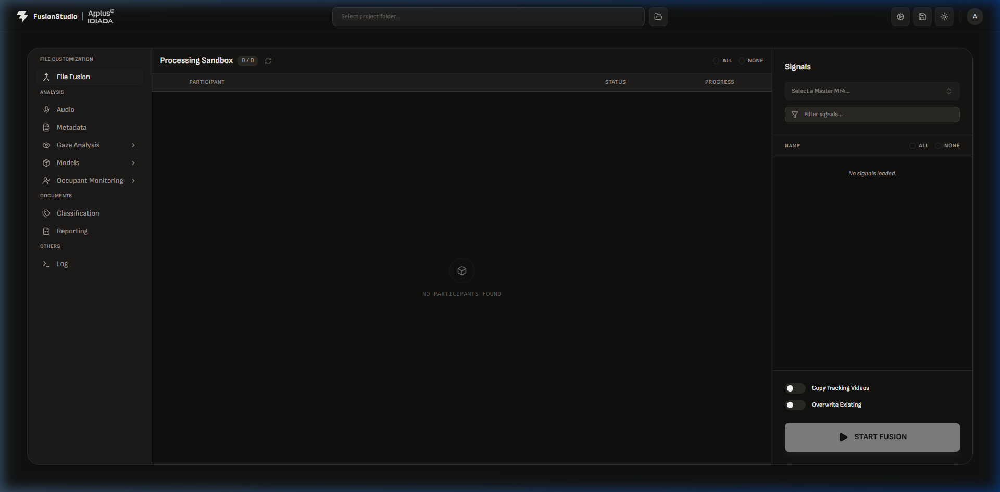
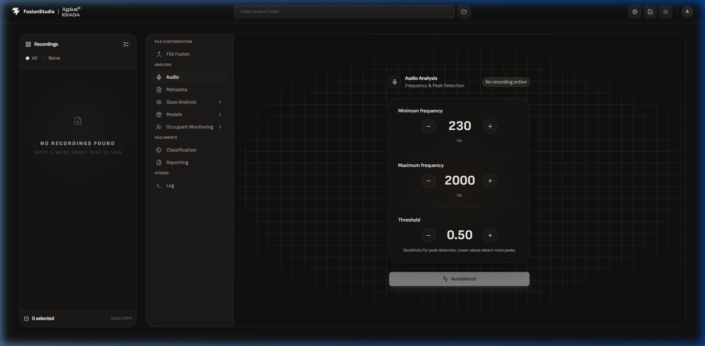
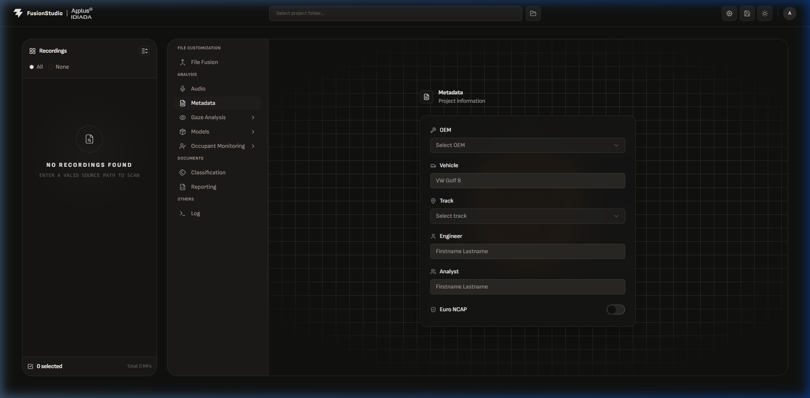
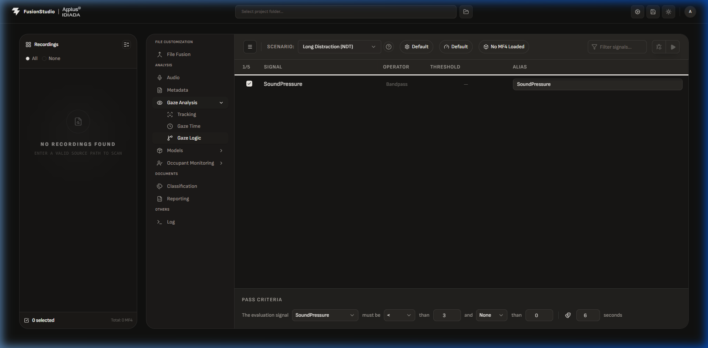
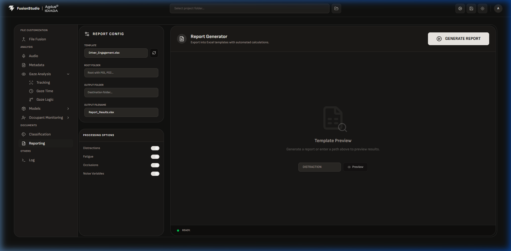

# ⚡ FusionStudio
## v26.0 — Automotive Safety Intelligence Platform

A professional desktop & web application for **ADAS / DMS compliance testing**.
Merges CAN bus data, video recordings, and acoustic signals into publication-grade engineering reports.

Developed for **internal use** at [Applus+ IDIADA](https://www.idiada.com/) — *Human Factors & Active Safety Department* — as the core utility to audit, evaluate, and certify compliance of Advanced Driver-Assist Systems (ADAS) and Driver Monitoring Systems (DMS) against Euro NCAP and ADDW regulatory protocols.

---

## 📑 Table of Contents

- [🚀 Quick Start & Desktop Execution](#-quick-start--desktop-execution)
- [📂 Project Directory Layout](#-project-directory-layout)
- [⚙️ Tab-by-Tab Reference Manual](#-tab-by-tab-reference-manual)
  - [1. File Fusion (Sandbox)](#1--file-fusion-sandbox)
  - [2. Audio Analysis](#2--audio-analysis)
  - [3. Metadata Config](#3--metadata-config)
  - [4. Gaze Analysis: Tracking](#4--gaze-analysis-tracking)
  - [5. Gaze Analysis: Gaze Time Selector](#5--gaze-analysis-gaze-time-selector)
  - [6. Gaze Analysis: Gaze Logic (Rules Engine)](#6--gaze-analysis-gaze-logic-rules-engine)
  - [7. Occupant Monitoring](#7--occupant-monitoring)
  - [8. Classification & Annotations](#8--classification--annotations)
  - [9. Report Generator](#9--report-generator)
  - [10. HuMind (ML Models)](#10--humind-ml-models)
  - [11. System Diagnostics (Log)](#11--system-diagnostics-log)
- [📋 Standard Operating Procedure (SOP)](#-standard-operating-procedure-sop)
- [🛠️ Developer Setup & Tech Stack](#-developer-setup--tech-stack)
- [📜 License](#-license)

---

## 🚀 Quick Start & Desktop Execution

### Prerequisites
For end-users and test engineers running the packaged application, there are **no software prerequisites**. You do not need Python, Node.js, or local libraries installed on your machine. The app is fully portable.

### Double-Click Launch
1. Open the distributed project directory and locate the standalone folder: `dist/FusionStudio/`.
2. Locate and double-click the executable: `FusionStudio.exe`.
3. The application will initialize, displaying a custom loading splash animation while starting background processing layers. Once ready, the main application window will open automatically.

> **Tip for engineers:** If the application fails to start or says a port is occupied, ensure no previous background instances are running. You can close stale instances from Windows Task Manager or run `taskkill /f /im FusionStudio.exe` in Command Prompt.

---

## 📂 Project Directory Layout

```
FusionStudio/
├── backend/                  # FastAPI Application (Python)
│   ├── assets/               # Branding fonts, templates, and raw icons
│   │   ├── fonts/            # Montserrat font family (all weights)
│   │   ├── icons/            # SVG/PNG action and UI graphics
│   │   ├── readme_images/    # Reference images used in this documentation
│   │   └── templates/        # Excel (.xlsx) report templates
│   ├── config/               # Active JSON rulesets & evaluation parameters
│   │   └── gauge_rules.json  # ← THE central config: all thresholds, operators, phases
│   ├── core/                 # Algorithmic engines and file utilities
│   │   ├── ai_analyzer.py    # Distraction & fatigue ML inference pipeline
│   │   ├── excel_exporter.py # Excel sheet compiler and data populator
│   │   ├── report_builder.py # Matplotlib plot rendering & PDF/PNG generator
│   │   └── utils.py          # Path resolution helpers (handles PyInstaller bundles)
│   ├── models/               # Pre-trained ML classifiers (pickled / ONNX)
│   │   └── distraction_detector/
│   ├── routers/              # FastAPI endpoint routing (one file per feature domain)
│   ├── ws/                   # Real-time WebSocket hubs (log streaming, live updates)
│   └── main.py               # Backend service entry point — registers all routers
│
├── frontend/                 # React Web App (TypeScript + Vite)
│   ├── src/
│   │   ├── components/       # Reusable UI: Toggles, Charts, Tab panels, Modals
│   │   └── lib/              # Shared TypeScript helpers and API clients
│   ├── package.json          # Node dependencies & npm scripts
│   ├── tsconfig.json         # TypeScript path aliases (e.g., @/ → src/)
│   └── vite.config.ts        # Vite build configuration & proxy settings
│
├── dev.bat                   # Unified local development launcher  ← start here
├── requirements.txt          # All Python backend dependencies
├── LICENSE                   # Licensing terms (Applus+ IDIADA)
└── README.md                 # This file
```

> **Key file to know:** `backend/config/gauge_rules.json` is the single source of truth for all evaluation logic. Every threshold, operator, and phase duration is read from here at runtime. Editing it in the **Gaze Logic** tab auto-saves back to this file.


---

## ⚙️ Tab-by-Tab Reference Manual

The application is organized into a series of tabs, each representing a distinct phase of the data-processing and evaluation workflow. Below is an exhaustive breakdown of every tab, every control, and every hidden mechanism.

---

### 1. 🧩 File Fusion (Sandbox)

The **File Fusion** tab is your data preparation workspace. Before any analysis can happen, raw sensor recordings from multiple independent devices must be time-aligned and merged into a single, unified data file.



#### What it does under the hood

FusionStudio's data model assumes a **Master + Satellite** architecture:

- **Master MF4** — the vehicle's primary CAN/Ethernet bus log (contains acceleration, speed, braking events, ADAS system states, etc.). This is the authoritative time reference.
- **Satellite Files** — secondary recordings captured by peripheral sensors at a different clock (e.g., eye-tracker outputs, acoustic microphone readings). These have their own timestamps that need aligning.

The fusion algorithm:

1. Scans the active project directory for participant subfolders (e.g., `P01/`, `P02/`)
2. Locates the Master MF4 and all Satellite MF4 files within each folder
3. Identifies the **start-of-test trigger** in both signals (typically a synchronized event marker or rising edge)
4. Computes the **time-offset delta** between the two clocks and shifts the satellite timeline accordingly
5. Intersects both time vectors to find the **common valid window**
6. Writes the merged output as a `*_fused.mf4` file using the `asammdf` library

#### Controls & Parameters

| Control                         | Description                                                                                                                                                                                                                                                                        |
| ------------------------------- | ---------------------------------------------------------------------------------------------------------------------------------------------------------------------------------------------------------------------------------------------------------------------------------- |
| **Processing Sandbox List**     | Central participant card view. Each card shows: badges for fused satellite files ✅, copyable tracking videos 🎥, and master file status 📄. Check/uncheck participants to include or exclude them from the batch.                                                                 |
| **All / None Radio Buttons**    | Instantly select or deselect all participants. Useful when you want to run a single participant — click _None_, then check only the one you need.                                                                                                                                  |
| **Source Path Input**           | The root project directory. The app recursively scans this folder to populate the sandbox list. Change this if your test data lives in a different location.                                                                                                                       |
| **Master MF4 Dropdown**         | Lists all `.mf4` files found in the source path that match the master naming convention. The selected file defines the **signal schema** — i.e., which channels exist and at what sample rate.                                                                                     |
| **Filter Signals Input**        | Type-ahead search box to narrow down the signals list below it. Useful when bus logs contain hundreds of channels and you only need a specific subset.                                                                                                                             |
| **Signal Checkboxes**           | A whitelist selector. **Checked signals** are preserved in the fused output. **Unchecked signals are dropped**, which is critical for performance — raw bus logs from a full test day can be 10–20 GB; filtering to only the required channels reduces output to manageable sizes. |
| **Copy Tracking Videos Toggle** | When ON, the fusion process also copies and renames camera `.avi` files from the source location into the participant's output folder, keeping video evidence co-located with data.                                                                                                |
| **Overwrite Existing Toggle**   | By default, the fusion process **skips** participants that already have a `*_fused.mf4` file (to save time on reruns). Toggle this ON to **force regeneration** even if a fused file already exists — useful after changing the signal whitelist.                                  |
| **START FUSION**                | Kicks off the background batch fusion loop. Progress is streamed in real time via WebSocket to the UI.                                                                                                                                                                             |
| **PAUSE / RESUME**              | Suspends and resumes the fusion loop mid-batch — handy if you need to free up system resources temporarily without aborting the entire job.                                                                                                                                        |
| **STOP**                        | Cleanly aborts the fusion loop. Already-completed participants are kept; in-progress ones may result in an incomplete fused file.                                                                                                                                                  |


---

### 2. 🔊 Audio Analysis

The **Audio Analysis** tab is a frequency-domain calibration tool. Its job is to teach the system how to automatically recognize the acoustic warning chime (buzzer) buried inside hours of raw audio recorded by the test vehicle's microphones.



#### What it does under the hood

The raw audio signal (`SoundPressure`) captured during testing contains a mix of:

- Engine rumble and wind noise (broadband, low frequency)
- Passenger cabin sounds (speech, movement)
- The **alert chime** — a narrow-band tone at a specific frequency (e.g., 840 Hz or 1200 Hz depending on the vehicle OEM)

The algorithm:

1. Takes a representative slice of the raw audio signal
2. Applies a **Fast Fourier Transform (FFT)** to convert the time-domain signal into the frequency domain
3. Identifies the **dominant peak frequency** in the spectrum — this is the alert chime
4. Sets a **±15 Hz bandpass window** centered on that peak to isolate the chime and reject all other noise
5. Applies the bandpass filter and uses the resulting envelope to detect chime **onset times** with sample-accurate precision

#### Controls & Parameters

| Control                    | Description                                                                                                                                                                                                                                                                                                                                                          |
| -------------------------- | -------------------------------------------------------------------------------------------------------------------------------------------------------------------------------------------------------------------------------------------------------------------------------------------------------------------------------------------------------------------- |
| **Minimum Frequency (Hz)** | Lower bound of the bandpass filter. Adjust using `(−)` / `(+)` buttons. Hold the button down to accelerate the rate of change — useful for coarse adjustments. The default range starts at 0 Hz.                                                                                                                                                                     |
| **Maximum Frequency (Hz)** | Upper bound of the bandpass filter. Together with the minimum, this defines the frequency "window" the detector listens through. A wider window increases sensitivity but also captures more noise.                                                                                                                                                                  |
| **Threshold**              | Detection sensitivity scalar, ranging from `0.01` to `5.00`. Think of it as a **noise gate**: the detector only fires when the filtered signal envelope exceeds this value. **Lower** = detects quieter chimes but risks false positives. **Higher** = fewer false positives but may miss subtle chimes in noisy environments. Start with `0.5` and tune from there. |
| **Autodetect Button**      | The magic button. Triggers the FFT sweep on the currently loaded audio channel, finds the spectral peak, and **automatically sets the Min/Max frequency window**. Always try this first — manual tuning is only needed for unusual chime shapes or vehicles with multiple simultaneous alerts.                                                                       |

> **Pro tip:** After running Autodetect, zoom into the audio waveform and visually verify that the highlighted onset markers align with the visible spikes. If they're slightly off, reduce the Threshold by `0.1` increments until alignment is perfect.


---

### 3. 🗂️ Metadata Config

The **Metadata** tab records the administrative and environmental context of the test session. This information propagates to all report headers, PDF exports, and the central database index — ensuring every report is fully traceable to its test conditions.



#### Controls & Parameters

| Control              | Description                                                                                                                                                                                                                                                                            |
| -------------------- | -------------------------------------------------------------------------------------------------------------------------------------------------------------------------------------------------------------------------------------------------------------------------------------- |
| **OEM**              | Dropdown list of automotive manufacturers (e.g., Volkswagen, BMW, Mercedes, Stellantis). This appears in report headers and database filters.                                                                                                                                          |
| **Vehicle**          | Free-form text input for the specific model and variant (e.g., `VW Golf 8 GTI`, `BMW iX3 2024`). Be precise — this is how different test campaigns are disambiguated in the archive.                                                                                                   |
| **Track**            | Dropdown organized by location: **HQ Tracks** (Winding Road, Highway Loop, Dry Handling, Wet Circle, etc.) and **ICPG Tracks** (High Speed Circuit, Durability Loop, Test Hills). Also supports free-text entry for non-standard locations.                                            |
| **Engineer**         | Name of the test engineer who physically ran the trial. Logged in the report footer.                                                                                                                                                                                                   |
| **Analyst**          | Name of the data analyst processing the files (often the person using FusionStudio). May differ from the engineer if post-processing is done at a later date.                                                                                                                          |
| **Euro NCAP Switch** | Activates Euro NCAP compliance mode. When ON, report generation applies NCAP-specific pass/fail constraints and formats. When OFF, the evaluation uses the more permissive internal ADDW criteria. **Set this before generating reports** — it affects threshold application globally. |


---

### 4. 👁️ Gaze Analysis: Tracking

The **Tracking** sub-tab gives you a live spatial map of where the driver's eyes and head are pointed at any given timestamp. It's a diagnostic tool — use it to visually confirm that the DMS sensor is recording meaningful data before investing time in detailed analysis.

#### What it does under the hood

It reads the following signal streams from the fused MF4 file and plots them in real time:

- **Gaze Vector** (`Gaze_X`, `Gaze_Y`, `Gaze_Z`) — the 3D unit vector pointing from the driver's eye in the direction of their gaze
- **Head Rotation** (`Head_Pitch`, `Head_Yaw`, `Head_Roll`) — Euler angles of the head relative to the vehicle cabin
- **Pupil Diameter** — used as a secondary fatigue/attention proxy

These coordinates are overlaid on a **wireframe dashboard model** that defines named gaze zones:

| Zone               | Description                                |
| ------------------ | ------------------------------------------ |
| **Windshield**     | Forward road-facing gaze — the "safe" zone |
| **Left Mirror**    | Side mirror check                          |
| **Right Mirror**   | Side mirror check                          |
| **Cluster**        | Instrument cluster (speedometer, warnings) |
| **Infotainment**   | Central screen / touchscreen               |
| **Center Console** | Physical controls, gear lever              |

#### Camera Selector

> ⚠️ **This control is critical and often overlooked.**

The **Camera Selector** dropdown at the top of the Tracking tab determines which camera feed is used as the spatial reference for the gaze overlay. In multi-camera setups (e.g., a DMS camera facing the driver + a road-facing camera), you **must select the driver-facing (DMS) camera** here. Selecting the wrong camera will cause the gaze coordinates to be projected onto an incorrect spatial frame, making the zone overlay meaningless.

**How to identify the correct camera:** Look for a camera label containing terms like `DMS`, `Driver`, `Face`, `Interior`, or `IR_Cam`. When selected, the wireframe dashboard model should align with the visible dashboard geometry in the video feed.


---

### 5. ⏱️ Gaze Analysis: Gaze Time Selector

The **Gaze Time Selector** is the most hands-on, precision-critical tab in the entire application. This is where the engineer becomes the source of truth: reviewing synchronized signal charts alongside in-cabin video to place **frame-accurate event markers** that define the timeline of each trial.

#### What it does under the hood

- Uses **`uPlot`** — an ultra-fast, Canvas-based charting library — to render synchronized timelines with thousands of data points at 60 fps without lag
- Synchronizes the video player's seek position with the timeline cursor via `requestAnimationFrame`, achieving sub-frame visual alignment
- All placed markers are stored in a local database keyed to the participant + trial case combination, enabling resumable auditing sessions across multiple days

#### Subject & Case Navigation

| Control              | Shortcut      | Description                                                                                                                                                                                    |
| -------------------- | ------------- | ---------------------------------------------------------------------------------------------------------------------------------------------------------------------------------------------- |
| **Subject Dropdown** | —             | Selects the active participant (e.g., `P01`, `P02`). Switching subjects reloads the trial list and clears the chart.                                                                           |
| **Case Dropdown**    | —             | Selects the trial within the participant (e.g., `Microsleep_01`, `Drowsiness_03`, `UnresponsiveDriver_SLE_02`). Each case corresponds to a specific test scenario recorded during the session. |
| **Prev Case Button** | `Shift + Tab` | Steps to the previous trial case in the list. Ideal for sequential auditing workflows.                                                                                                         |
| **Next Case Button** | `Tab`         | Steps to the next trial case. Use this to move through all cases without touching the mouse.                                                                                                   |

#### Signal Selection — Top & Bottom Charts

Each Gaze Time Selector panel has **two independent chart slots** (Top Chart and Bottom Chart), each with its own signal selector dropdown. This lets you compare two related signals side by side to catch correlated events.

Common signal pairings used in practice:

| Scenario               | Top Chart                | Bottom Chart     |
| ---------------------- | ------------------------ | ---------------- |
| Head movement analysis | `Head_H_Angle`           | `Head_V_Angle`   |
| Combined gaze + head   | `Gaze_Y`                 | `Head_Pitch`     |
| Fatigue detection      | `Eye_Closure_Rate`       | `Pupil_Diameter` |
| Acoustic + gaze sync   | `SoundPressure_Filtered` | `Gaze_Z`         |

> **Tip:** You can change the signal in a chart at any time without losing your existing markers.

#### Chart Interaction

| Interaction                    | Result                                                                                                                       |
| ------------------------------ | ---------------------------------------------------------------------------------------------------------------------------- |
| **Left-click + Drag**          | Zooms into the selected time range. Essential for finding exact millisecond-level event boundaries.                          |
| **Mouse Wheel**                | Zoom in/out centered on the cursor position. Use for navigating across the full trial duration.                              |
| **Left-click** (on chart)      | Places an **event marker** at that exact timestamp. A vertical line appears.                                                 |
| **Right-click** (on a marker)  | Opens a context menu with an option to **remove** that specific marker.                                                      |
| **Click + Drag** (on a marker) | Moves the marker left/right to fine-tune its timestamp. Useful after placing an approximate marker and wanting to refine it. |

#### Video Control Bar

The synchronized video player is the engineer's ground truth — you use it to **confirm what the signal is telling you**.

| Control                        | Description                                                                                                                                                                                                                                                                                                   |
| ------------------------------ | ------------------------------------------------------------------------------------------------------------------------------------------------------------------------------------------------------------------------------------------------------------------------------------------------------------- |
| **Play / Pause**               | Standard playback. The chart cursor follows the video timestamp in real time.                                                                                                                                                                                                                                 |
| **Sync Toggle**                | When ON, moving the mouse over the chart **seeks the video** to the corresponding timestamp. This is the primary auditing workflow: hover over the chart → watch the video frame → confirm the event → click to place a marker. When OFF, the video and chart are decoupled, allowing independent navigation. |
| **Zoom Slider (1.0× to 3.0×)** | Zooms into the video player window (digital zoom). Use at 2.0×–3.0× when auditing eye closure events — pupil and eyelid detail becomes much easier to judge at higher zoom.                                                                                                                                   |

#### Marker Management

| Control             | Shortcut       | Description                                                                                                                          |
| ------------------- | -------------- | ------------------------------------------------------------------------------------------------------------------------------------ |
| **Undo**            | `Ctrl + Z`     | Reverts the last marker action (place, move, or delete). Supports multiple undo levels.                                              |
| **Clear All Marks** | `Ctrl + Space` | Deletes **all** markers for the currently active trial case. Use with caution — this is not undoable. A confirmation prompt appears. |


---

### 6. 🧠 Gaze Analysis: Gaze Logic (Rules Engine)

The **Gaze Logic** tab is the engine room of compliance evaluation. Instead of hard-coding pass/fail criteria into the application, FusionStudio reads all rules from a live JSON configuration, which you can edit directly here. This design allows the same application to be used across different regulatory frameworks and OEM-specific protocols without redeployment.



#### What it does under the hood

All logic is stored in and read from `backend/config/gauge_rules.json`. This file defines:

- Which signals to monitor per scenario
- The pass/fail threshold and operator for each signal
- The phase durations and warning timeline structure for unresponsive driver scenarios

Changes made in this tab's UI are **immediately validated and saved** back to `gauge_rules.json` when you click **Save Config**.

#### Protocol & Category Selection

| Control               | Options                | Description                                                                                                                |
| --------------------- | ---------------------- | -------------------------------------------------------------------------------------------------------------------------- |
| **Protocol Selector** | `Euro NCAP`, `ADDW`    | Determines which ruleset tree is loaded. Each protocol has its own set of categories, thresholds, and timeline structures. |
| **Category Selector** | _(varies by protocol)_ | Selects the active evaluation scenario to configure.                                                                       |

**Euro NCAP categories:**

- `Long Distraction – NDT` / `Long Distraction – DT`
- `Short Distraction – NDT` / `Short Distraction – DT`
- `Microsleep`
- `Sleep`
- `Drowsiness`
- `Unresponsive Driver – SLE`
- `Unresponsive Driver – DTR`

**ADDW categories:**

- `High Speed`
- `Low Speed`

#### Signal Threshold Table

This table defines **what the system checks** for the selected category. Each row is one evaluation rule:

| Column              | Description                                                                                                                                                                                               |
| ------------------- | --------------------------------------------------------------------------------------------------------------------------------------------------------------------------------------------------------- |
| **Signal Name**     | The exact MF4 channel name to evaluate (must match the signal name in the fused file exactly — case sensitive). Common examples: `Eye_Closure`, `Head_H_Angle`, `ADAS_Warning_Active`.                    |
| **Operator**        | The logical comparison operator: `==`, `>`, `<`, `>=`, `<=`, `!=`. Combined with the threshold value, this defines the trigger condition (e.g., `Eye_Closure >= 0.85` means "eyes more than 85% closed"). |
| **Threshold Value** | The numeric boundary. Units depend on the signal (e.g., degrees for head angles, normalized 0–1 for eye closure, volts for analog channels).                                                              |
| **Alias**           | A short human-readable label used in report output, chart axes, and Excel column headers. Keeps generated reports clean when original signal names are long CAN channel identifiers.                      |

#### Unresponsive Driver Timeline Editor

This section is only active when `Unresponsive Driver – SLE` or `Unresponsive Driver – DTR` is selected. It configures the **state machine** that evaluates the sequential warning cascade.

The visual timeline shows the regulatory phase structure:

**SLE (Single Lane Exit) — 2 phases:**

```
│◄── Distinct Warning ──►│◄─ Emergency Function ─►│
│       ≤ 7 seconds       │      ≤ 5 seconds        │
```

**DTR (Driver Take-Over Request) — 3 phases:**

```
│◄── Phase 1 ──►│◄──── Phase 2 ────►│◄─── Phase 3 ───►│
│    3–4 sec    │      ≤ 4 sec       │     ≤ 5 sec      │
```

**Per-phase configuration parameters:**

| Parameter           | Description                                                                                                                                                                                                                                                                                |
| ------------------- | ------------------------------------------------------------------------------------------------------------------------------------------------------------------------------------------------------------------------------------------------------------------------------------------ |
| **Trigger Signal**  | The MF4 channel whose state change marks the start/end of this phase (e.g., `Horn_Active`, `Brake_Pressure`).                                                                                                                                                                              |
| **Operator**        | Comparison operator applied to the trigger signal (same options as the threshold table).                                                                                                                                                                                                   |
| **Threshold Value** | The crossing value that fires the phase transition.                                                                                                                                                                                                                                        |
| **Frequency (Hz)**  | The sampling rate at which the trigger signal is evaluated. For CAN signals, this should match the channel's native sample rate (typically 10–100 Hz). Setting it too low may miss brief signal spikes.                                                                                    |
| **Time Mask (s)**   | A minimum duration the trigger condition must hold before it is accepted as a valid phase boundary. Prevents spurious noise events from being misidentified as phase transitions. E.g., a mask of `0.1 s` means the condition must be satisfied continuously for 100 ms before it "fires". |

#### Config Buttons

| Button            | Description                                                                                                                                                 |
| ----------------- | ----------------------------------------------------------------------------------------------------------------------------------------------------------- |
| **Save Config**   | Writes the current UI state to `gauge_rules.json`. **Always save before running a report** — the report generator reads directly from this file at runtime. |
| **Export Config** | Exports the active ruleset as a standalone JSON file. Use this to archive a snapshot of your configuration or share it with another analyst.                |
| **Import Config** | Loads a previously exported JSON configuration. Overwrites the current UI state. Useful for switching between client-specific rulesets.                     |


---

### 7. 🧑‍🤝‍🧑 Occupant Monitoring

The **Occupant Monitoring** tab evaluates the state of vehicle occupants beyond just the driver — detecting misuse scenarios, out-of-position occupants, and child seat compliance.

#### What it does under the hood

Maps and evaluates signals related to:

- **Seat Weight Sensors** — determines if each seat is occupied and estimates occupant weight class
- **Seatbelt Buckle Status** (`Seatbelt_Driver_Buckled`, `Seatbelt_Passenger_Buckled`, etc.) — binary signal per seat
- **Child Seat Occupancy / Detection** — some OEM systems report child restraint presence via dedicated CAN frames

Evaluation runs checks defined in the misuse constraint ruleset, flagging conditions like:

- Seatbelt unbuckled while vehicle in motion
- Rear passenger seat occupied but belt not fastened
- Child seat detected but safety system not acknowledging it


---

### 8. 🏷️ Classification & Annotations

The **Classification & Annotations** tab is the quality-gate layer. Before data flows into final report generation, every trial must pass human review. This tab provides a structured, searchable annotation layer on top of the raw trial database.

#### What it does under the hood

- Each trial case is stored in a central database alongside its computed metrics
- Annotations are attached to trial records and are **non-destructive** — the underlying data is never modified
- The report generator can be configured to **automatically skip** trials tagged as `Invalid` or `No Signal`

#### Available Classification Tags

| Tag                   | Meaning                                                                                             |
| --------------------- | --------------------------------------------------------------------------------------------------- |
| `Valid`               | Trial passes quality review — data is clean, signals are complete, timestamps are reliable          |
| `Invalid`             | Trial is discarded — use this for clear sensor failures, test aborts, or participant non-compliance |
| `Needs Review`        | Flag for a second opinion — data looks unusual but may be salvageable after deeper investigation    |
| `No Signal`           | The required DMS/ADAS channel was missing or flatlined for the entire trial duration                |
| **Free-text Comment** | Any additional notes (e.g., `"Driver looked away at tunnel entry, unrelated to test"`)              |

> **Workflow recommendation:** Do one complete pass through all trials annotating `No Signal` and clear `Invalid` cases first. Then go back and do a second pass on `Needs Review` cases with a colleague.


---

### 9. 📊 Report Generator

The **Report Generator** is where everything comes together. After fusion, calibration, time-marking, and rule configuration, this tab runs the full evaluation pipeline and produces a publication-ready engineering report.



#### What it does under the hood

1. **Scans** all participant fused-data folders
2. **Reads** the time-marks placed in the Gaze Time Selector for each trial
3. **Applies** the `gauge_rules.json` thresholds to compute transition times, alert latencies, and pass/fail states
4. **Renders** Matplotlib plots — groups matching signals, strips common prefixes from axis labels, rotates y-axis labels 90° centered for readability, draws solid event boundary lines without text overlaps
5. **Populates** the selected Excel template with computed result tables, printing dates in European engineering format (`DD/MM/YYYY HH:MM:SS`)
6. **Exports** high-quality vector PNG plots and a PDF summary

#### Controls & Parameters

| Control                    | Description                                                                                                                                                                                                                                       |
| -------------------------- | ------------------------------------------------------------------------------------------------------------------------------------------------------------------------------------------------------------------------------------------------- |
| **Template Selector**      | Dropdown to choose the target Excel template (e.g., `Driver_Engagement.xlsx`, `DMS_Compliance.xlsx`). Templates define the column layout, formulas, and sheet names. The right template must be matched to the trial type.                        |
| **Root Folder Input**      | The directory containing all participant subfolders (`P01/`, `P02/`, ...). This is typically the same path used in the File Fusion tab.                                                                                                           |
| **Output Folder Input**    | Target directory where generated files (`.xlsx`, `.pdf`, plot `.png` files) will be written. The folder is created automatically if it doesn't exist.                                                                                             |
| **Output Filename Input**  | Base name for the generated report file (without extension). A timestamp suffix is appended automatically to prevent overwriting previous runs (e.g., `Campaign_A_Report_20250601_143022.xlsx`).                                                  |
| **Distractions Toggle**    | Includes/excludes the long and short distraction evaluation tables in the report. Disable when your test protocol does not include distraction scenarios.                                                                                         |
| **Fatigue Toggle**         | Includes/excludes the sleep, microsleep, and drowsiness result sheets.                                                                                                                                                                            |
| **Occlusions Toggle**      | Includes/excludes camera blockage evaluation (e.g., if the DMS camera was temporarily obstructed).                                                                                                                                                |
| **Behaviours Toggle**      | When ON, applies a noise filter pass that removes anomalous outlier data points before statistics are computed. Disable for raw unfiltered output.                                                                                                |
| **GENERATE REPORT**        | Triggers the full report generation pipeline. Progress is streamed to the UI. A typical campaign of 30 participants takes 60–120 seconds.                                                                                                         |
| **STOP**                   | Aborts the pipeline. Any reports already written to disk are kept; partially-generated files may be incomplete.                                                                                                                                   |
| **Template Preview Table** | After selecting a template, this renders a live tabular preview of the template's sheet structure (column names, expected data types) directly in the UI — so you can verify you've selected the right template before running the full pipeline. |


---

### 10. 🤖 HuMind (ML Models)

The **HuMind** tab is FusionStudio's machine learning management console. It exposes the lifecycle of the AI models used to automate driver state detection.

#### What it does under the hood

- Loads and displays **pre-trained classifier models** stored under `backend/models/`
- Shows training dataset provenance, hyperparameter choices, and performance metrics
- Provides controls to **reload** models (after you've dropped an updated model file into the folder) or **retrain** on new labeled data accumulated from the Classification & Annotations tab

#### Displayed Metrics

| Metric               | Description                                                                                                                        |
| -------------------- | ---------------------------------------------------------------------------------------------------------------------------------- |
| **Accuracy**         | Overall classification correctness on the validation set                                                                           |
| **F1-Score**         | Harmonic mean of precision and recall — more meaningful than accuracy for imbalanced datasets (e.g., where drowsy events are rare) |
| **Confusion Matrix** | Visual breakdown of true positives, false positives, true negatives, and false negatives per class                                 |

> **Note for analysts:** The `distraction_detector` model classifies DMS signal windows as `distracted` / `not distracted` with a sliding window of configurable length. If model accuracy drops after a new test campaign, consider retraining with the new session data appended to the training set.


---

### 11. 🖥️ System Diagnostics (Log)

The **System Diagnostics** tab is your real-time application terminal window. Every backend event, file operation, API call, and error gets logged here with microsecond precision.

#### What it does under the hood

- Establishes a persistent **WebSocket connection** to `/api/brain/ws/system`
- The backend emits structured log messages for every significant operation: file reads, MF4 parsing events, signal lookups, database writes, and errors
- Messages are color-coded by severity: `INFO` (gray), `WARNING` (amber), `ERROR` (red), `SUCCESS` (green)

#### When to use it

| Situation                 | What to look for                                                                                                     |
| ------------------------- | -------------------------------------------------------------------------------------------------------------------- |
| Fusion produces no output | Look for `FileNotFoundError` or `Permission denied` messages — the source path or master file might be misconfigured |
| Report shows blank cells  | Look for `Signal not found` warnings — the signal name in `gauge_rules.json` doesn't match what's in the fused MF4   |
| Audio Autodetect fails    | Look for `FFT returned no peaks` — the sound pressure channel might be empty or mislabeled                           |
| App hangs unexpectedly    | Look for `WebSocket disconnected` — the backend may have crashed; restart the executable `FusionStudio.exe`      |

> **Pro tip:** Keep this tab open in a second browser window while working. The microsecond timestamps help you correlate backend processing time with UI interactions during troubleshooting.


---

## 📋 Standard Operating Procedure (SOP)

Follow these steps to process a new test campaign from raw files to a final report:

### Step 1 — Fuse Raw Signals

1. Launch FusionStudio: `.\dev.bat`
2. Go to **File Fusion**
3. Set the **Source Path** to your campaign root directory. The sandbox populates automatically.
4. Select the participants you want to process (or click **All**)
5. Select the correct **Master MF4** file from the dropdown
6. Check only the signals you need in the signal whitelist (uncheck everything unused)
7. Click **START FUSION** and wait for completion ✅

### Step 2 — Calibrate Audio Alerts

1. Go to **Audio Analysis**
2. Load a representative trial recording
3. Click **Autodetect** — verify the detected frequency makes sense (check the Diagnostics log for the identified Hz value)
4. If the threshold causes false positives on background noise, increase it by `0.1` until clean

### Step 3 — Configure Metadata

1. Go to **Metadata Config**
2. Set the OEM, Vehicle model, Track, Engineer, and Analyst fields
3. Set the **Euro NCAP switch** to match your evaluation protocol

### Step 4 — Audit Trials (Time Selector)

1. Go to **Gaze Analysis → Gaze Time Selector**
2. Select participant and case using the dropdowns (or use `Tab` / `Shift+Tab` to step through)
3. **Enable Sync mode** on the video player
4. Hover over the chart: the video seeks to that timestamp
5. Find the exact frame of the eyes-closing event → click on the chart to place a marker
6. Find the acoustic warning onset (visible as a spike on the sound pressure chart) → place a warning marker
7. Find the emergency action trigger → place a final marker
8. Use `Ctrl+Z` to undo any misplaced markers
9. Repeat for all participants and all cases

### Step 5 — Verify Rules & Limits

1. Go to **Gaze Logic**
2. Select the protocol (`Euro NCAP` or `ADDW`) and the relevant category
3. Review the signal threshold table — confirm signal names match your MF4 channels exactly
4. For Unresponsive Driver scenarios, verify phase durations and trigger signals
5. Click **Save Config** ← **don't forget this step**

### Step 6 — Classify & Annotate

1. Go to **Classification & Annotations**
2. Mark any trials with sensor failures as `No Signal`
3. Mark clearly invalid trials as `Invalid`
4. Flag uncertain cases as `Needs Review` and revisit with a colleague

### Step 7 — Generate the Report

1. Go to **Report Generator**
2. Select the appropriate **Excel template**
3. Set the **Root Folder** (same as Step 1 source path) and **Output Folder**
4. Toggle on/off the report sections relevant to your test protocol
5. Click **GENERATE REPORT**
6. When complete, use the **Template Preview** to do a quick sanity-check on the output tables
7. Open the generated `.xlsx` file and the PDF summary to review final results


---

## 🛠️ Developer Setup & Tech Stack

If you are developing or building FusionStudio from source:

### Development Prerequisites
- **Python 3.11+** (must be on system `PATH`)
- **Node.js 18+** (for building the React frontend)

### Launching in Dev Mode
Run the following script from the project root:
```powershell
.\dev.bat
```
This launcher starts the FastAPI backend at `http://127.0.0.1:8001`, installs Node modules if missing, starts the Vite dev server at `http://localhost:5173`, and opens the application in your browser.

### Compiling and Packaging
To build the standalone `.exe` desktop application bundle:
```powershell
python scripts/build_desktop.py
```

### Core Technologies
| Layer                 | Technology             | Role                            |
| --------------------- | ---------------------- | ------------------------------- |
| **Backend**           | Python 3.11            | Core processing engine          |
| **API**               | FastAPI                | REST + WebSocket server         |
| **Frontend**          | React + TypeScript     | UI framework                    |
| **Build Tool**        | Vite                   | Fast frontend bundler           |
| **Charting**          | uPlot                  | Ultra-fast Canvas charts        |
| **Signal Processing** | asammdf                | ASAM MDF4 read/write            |
| **Numerical**         | NumPy / SciPy          | FFT, signal filtering           |
| **Reporting**         | Matplotlib + openpyxl  | Plots & Excel export            |
| **ML**                | scikit-learn           | Classifier training & inference |

---

## 📜 License

Proprietary — Applus+ IDIADA, Human Factors & Active Safety Department. All rights reserved. See `LICENSE` for full terms.
